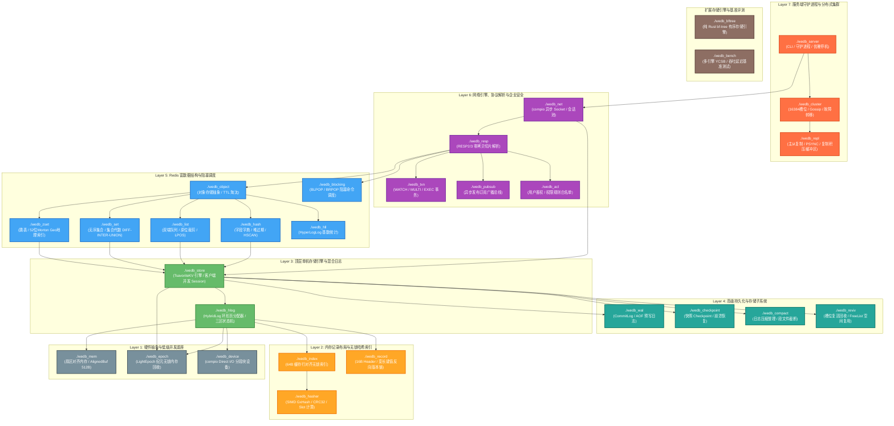

# WeDB (Garnet Rust)

> **基于现代 Rust 与 `compio` 异步底座的高性能分布式缓存与嵌入式存储引擎，全面重构微软官方顶级开源项目 [Microsoft Garnet](https://github.com/microsoft/garnet)。**

[](LICENSE)
[](Cargo.toml)
[-green.svg)](https://github.com/compio-rs/compio)
---


## 一、 项目简介与重构背景

**Microsoft Garnet** 是微软研究院开源的高吞吐、低延迟分布式缓存系统，其核心基于 C# / .NET 平台构建，并融合了 C++ Tsavorite (FASTER) 混合存储引擎与微软官方开源的 [bf-tree](https://crates.io/crates/bf-tree)（对应 [`bftree-garnet/`](https://github.com/microsoft/garnet/tree/main/libs/native/bftree-garnet) 跨语言 FFI 原生库）。尽管 Garnet 凭借 `Span<T>`、内存池化及指针优化取得了令人瞩目的基准性能，但在大规模工业生产实践中，.NET CLR 的分代垃圾回收（GC 停顿）、跨语言 FFI 边界开销以及复杂的单体工程结构依然带来了不可忽视的尾部延迟（Tail Latency）毛刺与维护挑战。

**WeDB (Garnet Rust)** 旨在以纯 Rust 语言对 Microsoft Garnet（源路径 [Microsoft Garnet](https://github.com/microsoft/garnet)）进行全栈、现代化、微模块化（Micro-Crates）的极致重构：
1. **纯粹原生异步**：全栈统一采用 `compio` 驱动的 Proactor 原生异步完成模型（Linux `io_uring` / Windows `IOCP` / macOS `kqueue`），彻底摈弃多余的运行时中间层与传统 Reactor 模式下 Epoll + 线程池的昂贵上下文切换。
2. **零 GC 停顿与亚微秒级延迟**：依托 Rust 严格的生命周期与 RAII 内存管理，消灭运行期垃圾回收停顿，P50 访问延迟降至 **0.17 μs**，P99 稳定在 **1.04 ~ 4.38 μs**。
3. **彻底的微模块架构**：将 C# 原版的庞大单体程序集拆分为 **29 个职责单一的微模块 (`./wedb_*`)**，具备严格的单向依赖 DAG，既可作为微型库按需嵌入，也可组合为完整的 Redis 兼容集群服务。
4. **高保真测试与缺陷规避**：对标 Garnet 官方测试套件进行 1:1 语义复刻迁移，并通过严苛的“连续 3 轮独立子代理 0 缺陷”收敛准则；同时在架构设计层面原生规避原版 C# 的历史隐患（例如 RESP 单字节参数溢出等缺陷）。

---

## 二、 核心设计理念与技术创新

```
       ┌────────────────────────────────────────────────────────┐
       │                 WeDB 核心技术创新矩阵                  │
       ├──────────────────────────┬─────────────────────────────┤
       │ 1. 混合日志原位覆盖      │ 3区动态滑动，可变区原地更新  │
       │    (In-Place Update)     │ 避免 LSM-Tree 写放大与重写   │
       ├──────────────────────────┼─────────────────────────────┤
       │ 2. 64B 缓存行对齐无锁索引│ 8槽位严格对齐，14-bit Tag   │
       │    (Lock-Free HashBucket)│ 原子 CAS 替换，消灭伪共享   │
       ├──────────────────────────┼─────────────────────────────┤
       │ 3. 纪元内存保护          │ LightEpoch 线程安全无锁回收 │
       │    (Epoch-Based Recycl.) │ 读零加锁，安全延迟内存回收  │
       ├──────────────────────────┼─────────────────────────────┤
       │ 4. 纯 Direct I/O 块驱动  │ 扇区对齐 (AlignedBuf 512B)  │
       │  (compio Direct I/O)     │ Linux 直穿磁盘，其余缓冲 I/O │
       ├──────────────────────────┼─────────────────────────────┤
       │ 5. 零拷贝协议解析        │ RESP2/3 切片借用状态机      │
       │    (Zero-Copy RESP)      │ 彻底消除命令解析的堆分配    │
       └──────────────────────────┴─────────────────────────────┘
```

- **三区滑动的 Tsavorite 混合日志 (HybridLog)**：
  - **Mutable Region (可变区)**：热点键值在内存中原地进行原子更新或覆盖，无须追加新版本，无须触发 WAL 刷盘与 Compaction，写吞吐高达 RocksDB 的 **17 ~ 31 倍**。
  - **ReadOnly Region (只读区)**：次热点数据进入只读保护状态，更新转为尾部 RCU 追加写入并建立反向版本链。
  - **OnDisk Region (磁盘冷区)**：冷数据通过 Direct I/O 异步落盘为固定大小的物理段文件（Segment Files），通过扇区对齐内存实现零拷贝冷读。
- **64 字节 CPU Cacheline 对齐的哈希索引**：
  - 每个哈希桶（HashBucket）严格约束为 64 字节，恰好填满一个 CPU 缓存行；
  - 桶内包含 8 个 Entry，利用高 14 位 Hash Tag 实现 O(1) SIMD 级快速比对，低 48 位存储逻辑地址指针；
  - 发生哈希冲突时通过无锁溢出桶链表动态扩容，读写操作使用原子 CAS 实现无锁并发。
- **并发纪元管理 (LightEpoch)**：
  - 借鉴微软 LightEpoch 算法，通过线程本地 Session 与全局 Epoch 计数器协同，实现无锁并发保护；
  - 线程进入临界区仅需原子更新本地 Epoch，读取数据无需任何互斥锁，并在 Epoch 推进后安全回收已删除内存。
- **解耦的 Redis 富数据结构**：
  - Redis 基础类型（Hash / List / Set / ZSet / HyperLogLog）完全独立成包，具备轻量级内存紧凑编码与高精度过期淘汰堆（HEXPIRE / EXPIRE）。
  - 有序集合（ZSet）结合跳表与 52 位 Morton 编码地理索引，兼顾范围切片检索与地理围栏（Geo）计算。

---

## 三、 全栈架构拓扑与模块映射图

### 3.1 全栈分层架构与数据流向拓扑



### 3.2 Garnet C# 单体程序集向 Rust 29 微 Crate 的解耦映射

```mermaid
graph LR
    classDef cs fill:#3f51b5, stroke:#1a237e, color:#fff, stroke-width:2px;
    classDef rust fill:#00897b, stroke:#004d40, color:#fff, stroke-width:2px;
    classDef ext fill:#8d6e63, stroke:#4e342e, color:#fff, stroke-width:2px;

    subgraph GarnetCS["Microsoft Garnet C# 单体模块"]
        CS_Host["main/GarnetServer<br/>(宿主与服务入口)"]:::cs
        CS_Server["libs/server<br/>(网络/RESP/数据结构/事务/ACL/AOF)"]:::cs
        CS_Tsavorite["libs/storage/Tsavorite<br/>(HybridLog/索引/设备/分配器/Epoch)"]:::cs
        CS_Cluster["libs/cluster<br/>(主从复制/槽位迁移/Gossip 集群)"]:::cs
        CS_Native["libs/native/bftree-garnet<br/>(C++ 原生动态库与 FFI)"]:::cs
        CS_Bench["benchmark<br/>(C# 性能基准测试工程)"]:::cs
    end

    subgraph WeDBRust["WeDB 29 个独立 Rust 微 Crate (Strict DAG)"]
        R_Svr["./wedb_server"]:::rust

        R_Net["./wedb_net"]:::rust
        R_Resp["./wedb_resp"]:::rust
        R_Txn["./wedb_txn"]:::rust
        R_Acl["./wedb_acl"]:::rust
        R_PubSub["./wedb_pubsub"]:::rust
        R_Obj["./wedb_object"]:::rust
        R_Hash["./wedb_hash"]:::rust
        R_List["./wedb_list"]:::rust
        R_Set["./wedb_set"]:::rust
        R_ZSet["./wedb_zset"]:::rust
        R_Hll["./wedb_hll"]:::rust
        R_Block["./wedb_blocking"]:::rust

        R_Store["./wedb_store"]:::rust
        R_Hlog["./wedb_hlog"]:::rust
        R_Wal["./wedb_wal"]:::rust
        R_Ckpt["./wedb_checkpoint"]:::rust
        R_Comp["./wedb_compact"]:::rust
        R_Reviv["./wedb_reviv"]:::rust
        R_Idx["./wedb_index"]:::rust
        R_Rec["./wedb_record"]:::rust
        R_Hashr["./wedb_hasher"]:::rust
        R_Mem["./wedb_mem"]:::rust
        R_Epoch["./wedb_epoch"]:::rust
        R_Dev["./wedb_device"]:::rust

        R_Clus["./wedb_cluster"]:::rust
        R_Repl["./wedb_repl"]:::rust

        R_BfTree["./wedb_bftree<br/>(原生 bf-tree 引擎)"]:::ext
        R_Bench["./wedb_bench"]:::ext
    end

    CS_Host --> R_Svr
    CS_Server --> R_Net
    CS_Server --> R_Resp
    CS_Server --> R_Txn
    CS_Server --> R_Acl
    CS_Server --> R_PubSub
    CS_Server --> R_Obj
    CS_Server --> R_Hash
    CS_Server --> R_List
    CS_Server --> R_Set
    CS_Server --> R_ZSet
    CS_Server --> R_Hll
    CS_Server --> R_Block
    CS_Server --> R_Wal
    CS_Server --> R_Ckpt

    CS_Tsavorite --> R_Store
    CS_Tsavorite --> R_Hlog
    CS_Tsavorite --> R_Comp
    CS_Tsavorite --> R_Reviv
    CS_Tsavorite --> R_Idx
    CS_Tsavorite --> R_Rec
    CS_Tsavorite --> R_Hashr
    CS_Tsavorite --> R_Mem
    CS_Tsavorite --> R_Epoch
    CS_Tsavorite --> R_Dev

    CS_Cluster --> R_Clus
    CS_Cluster --> R_Repl

    CS_Native --> R_BfTree
    CS_Bench --> R_Bench
```



---

## 四、 Rust 微 Crate 与 Garnet C# 源码映射全景

本项目将原版 Microsoft Garnet C# 仓库（包括核心服务 `libs/server`、分布式集群 `libs/cluster`、底座存储 `libs/storage/Tsavorite`、原生动态库 `libs/native` 及测试套件）逐一进行物理级拆解重构。

以下为全部 29 个 Rust 微 Crate 与 C# 源仓库的 1:1 映射全貌（所有路径均采用项目相对链接）：

### 4.1 Layer 1: 硬件抽象与低级并发底座

1. **[`wedb_mem`](./wedb_mem)**：扇区对齐内存与物理缓存池
   - **对标 Garnet C# 源码**: [`BufferPool.cs`](https://github.com/microsoft/garnet/blob/main/libs/storage/Tsavorite/cs/src/core/Utilities/BufferPool.cs), [`DirectVirtualMemory.cs`](https://github.com/microsoft/garnet/blob/main/libs/storage/Tsavorite/cs/src/core/Native/DirectVirtualMemory.cs)
   - **对应 C# 核心类/结构**: `SectorAlignedBufferPool`, `SectorAlignedMemory`, `DirectVirtualMemory`
   - **对标 Garnet C# 测试**: [`SectorAlignedBufferPoolTests.cs`](https://github.com/microsoft/garnet/blob/main/libs/storage/Tsavorite/cs/test/SectorAlignedBufferPoolTests.cs), [`SectorAlignedBufferPoolStressTests.cs`](https://github.com/microsoft/garnet/blob/main/libs/storage/Tsavorite/cs/test/SectorAlignedBufferPoolStressTests.cs)
   - **核心职责与重构升级**: 提供 512B / 4096B 物理对齐的 `AlignedBuf` 堆外缓冲区，无缝兼容 `compio_buf::IoBuf`，为操作系统 Direct I/O 提供零额外拷贝的底层 DMA 读写保障。

2. **[`wedb_epoch`](./wedb_epoch)**：无锁纪元保护 (LightEpoch)
   - **对标 Garnet C# 源码**: [`LightEpoch.cs`](https://github.com/microsoft/garnet/blob/main/libs/storage/Tsavorite/cs/src/core/Epochs/LightEpoch.cs)
   - **对应 C# 核心类/结构**: `LightEpoch`
   - **对标 Garnet C# 测试**: [`ProtectionTests.cs`](https://github.com/microsoft/garnet/blob/main/libs/storage/Tsavorite/cs/test/test.epoch/ProtectionTests.cs), [`DrainTests.cs`](https://github.com/microsoft/garnet/blob/main/libs/storage/Tsavorite/cs/test/test.epoch/DrainTests.cs)
   - **核心职责与重构升级**: 纯 Rust 实现轻量级纪元回收（EBR），通过 64 字节 CPU 缓存行填充杜绝伪共享（False Sharing），支持并发 Session 极速进出临界区，实现读取零阻塞、内存安全延迟回收。

3. **[`wedb_device`](./wedb_device)**：Direct I/O 异步分段块设备
   - **对标 Garnet C# 源码**: [`IDevice.cs`](https://github.com/microsoft/garnet/blob/main/libs/storage/Tsavorite/cs/src/core/Device/IDevice.cs), [`NativeStorageDevice.cs`](https://github.com/microsoft/garnet/blob/main/libs/storage/Tsavorite/cs/src/core/Device/NativeStorageDevice.cs)
   - **对应 C# 核心类/结构**: `IDevice`, `NativeStorageDevice`, `DeviceLogCommitResult`
   - **对标 Garnet C# 测试**: [`DeviceTests.cs`](https://github.com/microsoft/garnet/blob/main/libs/storage/Tsavorite/cs/test/test.hlog/DeviceTests.cs), [`DeviceLogTests.cs`](https://github.com/microsoft/garnet/blob/main/libs/storage/Tsavorite/cs/test/test.hlog/DeviceLogTests.cs)
   - **核心职责与重构升级**: 基于 `compio` 原生异步文件系统封装，支持 `O_DIRECT` / `FILE_FLAG_NO_BUFFERING`。管理分段物理文件（`.0`, `.1`...），在 Linux 默认启用 O_DIRECT 完全绕过操作系统 Page Cache，其余平台对齐 C# Managed 设备采用缓冲 I/O（享受页缓存与预读），并实现异步磁盘读写与段截断。

### 4.2 Layer 2: 内存记录布局与无锁哈希索引

4. **[`wedb_hasher`](./wedb_hasher)**：SIMD 硬件加速哈希与分片计算
   - **对标 Garnet C# 源码**: [`HashUtils.cs`](https://github.com/microsoft/garnet/blob/main/libs/common/HashUtils.cs), [`HashSlotUtils.cs`](https://github.com/microsoft/garnet/blob/main/libs/common/HashSlotUtils.cs)
   - **对应 C# 核心类/结构**: `HashUtils`, `HashSlotUtils`
   - **对标 Garnet C# 测试**: [`NumUtils.cs`](https://github.com/microsoft/garnet/blob/main/test/standalone/Garnet.test/NumUtils.cs)
   - **核心职责与重构升级**: 整合硬件加速 `gxhash`、FarmHash 与 CRC32Fast，负责 Redis 键哈希、14-bit 桶标签生成以及 16384 集群槽位 HashTag 提取。

5. **[`wedb_index`](./wedb_index)**：64B 缓存行对齐无锁哈希索引
   - **对标 Garnet C# 源码**: [`HashBucket.cs`](https://github.com/microsoft/garnet/blob/main/libs/storage/Tsavorite/cs/src/core/Index/Tsavorite/HashBucket.cs), [`HashBucketEntry.cs`](https://github.com/microsoft/garnet/blob/main/libs/storage/Tsavorite/cs/src/core/Index/Tsavorite/HashBucketEntry.cs)
   - **对应 C# 核心类/结构**: `HashBucket`, `HashBucketEntry`, `OverflowBucketLockTable`
   - **对标 Garnet C# 测试**: [`OverflowBucketLockTableTests.cs`](https://github.com/microsoft/garnet/blob/main/libs/storage/Tsavorite/cs/test/OverflowBucketLockTableTests.cs), [`NativeHashIndexTests.cs`](https://github.com/microsoft/garnet/blob/main/libs/storage/Tsavorite/cs/test/test.hlog/NativeHashIndexTests.cs)
   - **核心职责与重构升级**: 每个 HashBucket 严格约束为 64 字节，包含 8 个 Entry。利用 14 位 Hash Tag 快速过滤与原子 64-bit CAS 更新，搭配无锁溢出桶链表，消除哈希寻址的锁争用。

6. **[`wedb_record`](./wedb_record)**：变长记录二进制布局与反向版本链
   - **对标 Garnet C# 源码**: [`RecordDataHeader.cs`](https://github.com/microsoft/garnet/blob/main/libs/storage/Tsavorite/cs/src/core/Allocator/RecordDataHeader.cs), [`RecordInfo.cs`](https://github.com/microsoft/garnet/blob/main/libs/storage/Tsavorite/cs/src/core/Index/Common/RecordInfo.cs)
   - **对应 C# 核心类/结构**: `RecordInfo`, `RecordDataHeader`, `LogRecord`
   - **对标 Garnet C# 测试**: [`RecordTriggersExtTests.cs`](https://github.com/microsoft/garnet/blob/main/libs/storage/Tsavorite/cs/test/RecordTriggersExtTests.cs), [`DeleteDisposeTests.cs`](https://github.com/microsoft/garnet/blob/main/libs/storage/Tsavorite/cs/test/test.recordops/DeleteDisposeTests.cs)
   - **核心职责与重构升级**: 16 字节紧凑头部，内置墓碑（Tombstone）、封印（Sealed）和原位锁（InPlaceLock）标志位，包含指向前序历史版本的 48 位逻辑地址，支持只读切片借用与安全的原位可变视图。

### 4.3 Layer 3: 核心单机存储引擎与混合日志

7. **[`wedb_hlog`](./wedb_hlog)**：HybridLog 混合日志环形页分配器
   - **对标 Garnet C# 源码**: [`AllocatorBase.cs`](https://github.com/microsoft/garnet/blob/main/libs/storage/Tsavorite/cs/src/core/Allocator/AllocatorBase.cs), [`GenericAllocator.cs`](https://github.com/microsoft/garnet/blob/main/libs/storage/Tsavorite/cs/src/core/Allocator/AllocatorBase.cs)
   - **对应 C# 核心类/结构**: `AllocatorBase`, `SpanByteAllocator`, `HybridLogMemory`
   - **对标 Garnet C# 测试**: [`AllocateBlockPartialTests.cs`](https://github.com/microsoft/garnet/blob/main/libs/storage/Tsavorite/cs/test/AllocateBlockPartialTests.cs)
   - **核心职责与重构升级**: 管理 64 位连续逻辑地址空间，驱动 Mutable（就地更新）→ ReadOnly（RCU 追加）→ OnDisk（异步落盘）三区动态滑动。实现冷数据零堆分配原位切片投影与直接落盘。

8. **[`wedb_store`](./wedb_store)**：TsavoriteKV 顶层存储引擎与并发会话
   - **对标 Garnet C# 源码**: [`Tsavorite.cs`](https://github.com/microsoft/garnet/blob/main/libs/storage/Tsavorite/cs/src/core/Index/Tsavorite/Tsavorite.cs), [`ClientSession/`](https://github.com/microsoft/garnet/tree/main/libs/storage/Tsavorite/cs/src/core/ClientSession)
   - **对应 C# 核心类/结构**: `TsavoriteKV`, `ClientSession`, `BasicContext`
   - **对标 Garnet C# 测试**: [`NeedCopyUpdateTests.cs`](https://github.com/microsoft/garnet/blob/main/libs/storage/Tsavorite/cs/test/NeedCopyUpdateTests.cs), [`CancellationTests.cs`](https://github.com/microsoft/garnet/blob/main/libs/storage/Tsavorite/cs/test/CancellationTests.cs)
   - **核心职责与重构升级**: 协调读、写、更新（RMW）、删除生命周期，按线程分发轻量级 Session，整合 LightEpoch 保护，对外暴露高吞吐单机 KV 存储与开箱即用的嵌入式 Redis API。

### 4.4 Layer 4: 高级存储子系统 (WAL/快照/压缩/复活)

9. **[`wedb_wal`](./wedb_wal)**：预写日志 (WAL) 与 AOF 提交日志
   - **对标 Garnet C# 源码**: [`TsavoriteLog.cs`](https://github.com/microsoft/garnet/blob/main/libs/storage/Tsavorite/cs/src/core/TsavoriteLog/TsavoriteLog.cs), [`AofProcessor.cs`](https://github.com/microsoft/garnet/blob/main/libs/server/AOF/AofProcessor.cs), [`AofHeader.cs`](https://github.com/microsoft/garnet/blob/main/libs/server/AOF/AofHeader.cs)
   - **对应 C# 核心类/结构**: `TsavoriteLog`, `AofProcessor`, `AofHeader`
   - **对标 Garnet C# 测试**: [`TsavoriteLogAddressRangeTests.cs`](https://github.com/microsoft/garnet/blob/main/libs/storage/Tsavorite/cs/test/test.hlog/TsavoriteLogAddressRangeTests.cs), [`RespAofTornTailTests.cs`](https://github.com/microsoft/garnet/blob/main/test/standalone/Garnet.test/RespAofTornTailTests.cs)
   - **核心职责与重构升级**: 基于 `compio` 驱动的极速环形预写日志，支持批量提交异步刷盘（Async Fsync）、自动日志段切分滚动与宕机零拷贝重放恢复。

10. **[`wedb_checkpoint`](./wedb_checkpoint)**：非阻塞快照 Checkpoint 与恢复
    - **对标 Garnet C# 源码**: [`GarnetCheckpointManager.cs`](https://github.com/microsoft/garnet/blob/main/libs/server/GarnetCheckpointManager.cs), [`Checkpointing/`](https://github.com/microsoft/garnet/tree/main/libs/storage/Tsavorite/cs/src/core/Index/Checkpointing)
    - **对应 C# 核心类/结构**: `GarnetCheckpointManager`, `IndexCheckpoint`, `HybridLogCheckpoint`
    - **对标 Garnet C# 测试**: [`CheckpointManagerTests.cs`](https://github.com/microsoft/garnet/blob/main/libs/storage/Tsavorite/cs/test/test.recovery/CheckpointManagerTests.cs), [`RecoveryTests.cs`](https://github.com/microsoft/garnet/blob/main/libs/storage/Tsavorite/cs/test/test.recovery/RecoveryTests.cs)
    - **核心职责与重构升级**: 支持 Snapshot（全量快照）与 Fold-over 两种模式，实现哈希索引与混合日志的不停机后台原子刷写与断电快速一致性恢复。

11. **[`wedb_compact`](./wedb_compact)**：日志紧缩与历史段清理
    - **对标 Garnet C# 源码**: [`LogCompactionType.cs`](https://github.com/microsoft/garnet/blob/main/libs/server/LogCompactionType.cs), [`Compaction/`](https://github.com/microsoft/garnet/tree/main/libs/storage/Tsavorite/cs/src/core/Compaction)
    - **对应 C# 核心类/结构**: `CompactionMap`, `LogCompactionType`
    - **对标 Garnet C# 测试**: [`SpanByteLogCompactionTests.cs`](https://github.com/microsoft/garnet/blob/main/libs/storage/Tsavorite/cs/test/test.hlog/SpanByteLogCompactionTests.cs), [`ObjectLogCompactionTests.cs`](https://github.com/microsoft/garnet/blob/main/libs/storage/Tsavorite/cs/test/test.recovery/ObjectLogCompactionTests.cs)
    - **核心职责与重构升级**: 推进日志起始地址（BeginAddress），并发扫描过期日志段并自动重写存活键值至日志尾部，物理截断并删除已淘汰磁盘段文件，杜绝磁盘空间膨胀。

12. **[`wedb_reviv`](./wedb_reviv)**：日志槽位复活回收池 (Revivification)
    - **对标 Garnet C# 源码**: [`RevivificationManager.cs`](https://github.com/microsoft/garnet/blob/main/libs/storage/Tsavorite/cs/src/core/Index/Tsavorite/Implementation/Revivification/RevivificationManager.cs), [`FreeRecordPool.cs`](https://github.com/microsoft/garnet/blob/main/libs/storage/Tsavorite/cs/src/core/Index/Tsavorite/Implementation/Revivification/FreeRecordPool.cs)
    - **对应 C# 核心类/结构**: `RevivificationManager`, `FreeRecordPool`, `RevivificationSettings`
    - **对标 Garnet C# 测试**: [`RevivificationTests.cs`](https://github.com/microsoft/garnet/blob/main/libs/storage/Tsavorite/cs/test/test.recordops/RevivificationTests.cs)
    - **核心职责与重构升级**: 维护基于大小分级的空闲槽位链表（FreeList），直接在内存可变区就地复用已被删除或覆盖的记录空间，极大降低日志尾部写入增长速度。

### 4.5 Layer 5: Redis 富数据结构与阻塞调度

13. **[`wedb_object`](./wedb_object)**：对象存储抽象与生命周期 TTL
    - **对标 Garnet C# 源码**: [`GarnetObject.cs`](https://github.com/microsoft/garnet/blob/main/libs/server/Objects/Types/GarnetObject.cs), [`GarnetObjectBase.cs`](https://github.com/microsoft/garnet/blob/main/libs/server/Objects/Types/GarnetObjectBase.cs)
    - **对应 C# 核心类/结构**: `GarnetObject`, `GarnetObjectBase`, `ExpirationWithOpt`
    - **对标 Garnet C# 测试**: [`GarnetObjectTests.cs`](https://github.com/microsoft/garnet/blob/main/test/standalone/Garnet.test.collections/GarnetObjectTests.cs), [`ExpiredKeyDeletionTests.cs`](https://github.com/microsoft/garnet/blob/main/test/standalone/Garnet.test/ExpiredKeyDeletionTests.cs)
    - **核心职责与重构升级**: 定义 Redis 复杂类型的统一内存包装，支持毫秒级绝对/相对 TTL 淘汰管理，提供极度紧凑的二进制序列化格式。

14. **[`wedb_hash`](./wedb_hash)**：Redis Hash 字典结构
    - **对标 Garnet C# 源码**: [`HashObject.cs`](https://github.com/microsoft/garnet/blob/main/libs/server/Objects/Hash/HashObject.cs)
    - **对应 C# 核心类/结构**: `HashObject`
    - **对标 Garnet C# 测试**: [`RespHashTests.cs`](https://github.com/microsoft/garnet/blob/main/test/standalone/Garnet.test.collections/RespHashTests.cs)
    - **核心职责与重构升级**: 基于 SIMD 哈希的紧凑字典结构，支持字段级别独立 TTL 过期淘汰堆（HEXPIRE / HTTL），实现无分配 HSCAN 游标遍历与原子 HINCRBY。

15. **[`wedb_list`](./wedb_list)**：Redis List 双端队列
    - **对标 Garnet C# 源码**: [`ListObject.cs`](https://github.com/microsoft/garnet/blob/main/libs/server/Objects/List/ListObject.cs)
    - **对应 C# 核心类/结构**: `ListObject`
    - **对标 Garnet C# 测试**: [`RespListTests.cs`](https://github.com/microsoft/garnet/blob/main/test/standalone/Garnet.test.collections/RespListTests.cs), [`RespListGarnetClientTests.cs`](https://github.com/microsoft/garnet/blob/main/test/standalone/Garnet.test.collections/RespListGarnetClientTests.cs)
    - **核心职责与重构升级**: 高性能分段双端队列，支持 LPUSH/RPUSH、LPOP/RPOP、LPOS 原位匹配、LTRIM 零拷贝范围裁剪与 RPOPLPUSH 原子转移。

16. **[`wedb_set`](./wedb_set)**：Redis Set 无序集合与代数运算
    - **对标 Garnet C# 源码**: [`SetObject.cs`](https://github.com/microsoft/garnet/blob/main/libs/server/Objects/Set/SetObject.cs)
    - **对应 C# 核心类/结构**: `SetObject`
    - **对标 Garnet C# 测试**: [`RespSetTest.cs`](https://github.com/microsoft/garnet/blob/main/test/standalone/Garnet.test.collections/RespSetTest.cs)
    - **核心职责与重构升级**: 针对 CPU 缓存优化的集合结构，支持流式 SDIFF / SINTER / SUNION 高速代数运算与反向二进制 SSCAN 游标遍历。

17. **[`wedb_zset`](./wedb_zset)**：Redis SortedSet 跳表与 Geo 空间索引
    - **对标 Garnet C# 源码**: [`SortedSetObject.cs`](https://github.com/microsoft/garnet/blob/main/libs/server/Objects/SortedSet/SortedSetObject.cs), [`GeoHash.cs`](https://github.com/microsoft/garnet/blob/main/benchmark/BDN.benchmark/Geo/GeoHash.cs)
    - **对应 C# 核心类/结构**: `SortedSetObject`, `GeoHash`
    - **对标 Garnet C# 测试**: [`RespSortedSetTests.cs`](https://github.com/microsoft/garnet/blob/main/test/standalone/Garnet.test.collections/RespSortedSetTests.cs), [`GeoHashTests.cs`](https://github.com/microsoft/garnet/blob/main/test/standalone/Garnet.test.collections/GeoHashTests.cs)
    - **核心职责与重构升级**: 带跨度（Span）排名的多层跳表，支持按分值/字典序范围扫描，内嵌 52 位 Morton 码 Geo 算法，提供 GEOADD、GEODIST 与精确半径 GEOSEARCH。

18. **[`wedb_hll`](./wedb_hll)**：HyperLogLog 基数统计
    - **对标 Garnet C# 源码**: [`HyperLogLog.cs`](https://github.com/microsoft/garnet/blob/main/libs/server/Resp/HyperLogLog/HyperLogLog.cs), [`HyperLogLogCommands.cs`](https://github.com/microsoft/garnet/blob/main/libs/server/Resp/HyperLogLog/HyperLogLogCommands.cs)
    - **对应 C# 核心类/结构**: `HyperLogLog`
    - **对标 Garnet C# 测试**: [`HyperLogLogTests.cs`](https://github.com/microsoft/garnet/blob/main/test/standalone/Garnet.test.complexstring/HyperLogLogTests.cs)
    - **核心职责与重构升级**: 标准 16384 寄存器基数估算器，支持 Sparse（稀疏位编码）到 Dense（稠密编码）自适应转换，以及 SIMD 加速的 PFMERGE 寄存器合并。

19. **[`wedb_blocking`](./wedb_blocking)**：阻塞命令调度中继器
    - **对标 Garnet C# 源码**: [`CollectionItemBroker.cs`](https://github.com/microsoft/garnet/blob/main/libs/server/Objects/ItemBroker/CollectionItemBroker.cs), [`CollectionItemObserver.cs`](https://github.com/microsoft/garnet/blob/main/libs/server/Objects/ItemBroker/CollectionItemObserver.cs)
    - **对应 C# 核心类/结构**: `CollectionItemBroker`, `CollectionItemObserver`, `CollectionItemResult`
    - **对标 Garnet C# 测试**: [`RespBlockingCollectionTests.cs`](https://github.com/microsoft/garnet/blob/main/test/standalone/Garnet.test.collections/RespBlockingCollectionTests.cs)
    - **核心职责与重构升级**: 负责 BLPOP、BRPOP、BZPOPMIN/MAX 等阻塞命令的异步事件中继、超时精确计时器管理与 FIFO 唤醒队列调度。

### 4.6 Layer 6: RESP 协议、极速网络与企业级安全

20. **[`wedb_resp`](./wedb_resp)**：RESP2 / RESP3 零拷贝协议解析引擎
    - **对标 Garnet C# 源码**: [`SessionParseState.cs`](https://github.com/microsoft/garnet/blob/main/libs/server/Resp/Parser/SessionParseState.cs), [`ParseUtils.cs`](https://github.com/microsoft/garnet/blob/main/libs/server/Resp/Parser/ParseUtils.cs)
    - **对应 C# 核心类/结构**: `SessionParseState`, `RespParser`, `SessionParseStateExtensions`
    - **对标 Garnet C# 测试**: [`RespTests.cs`](https://github.com/microsoft/garnet/blob/main/test/standalone/Garnet.test/RespTests.cs), [`RespCommandTests.cs`](https://github.com/microsoft/garnet/blob/main/test/standalone/Garnet.test/RespCommandTests.cs)
    - **核心职责与重构升级**: 基于单次循环 DFA 状态机直接在网络缓冲区原位切片投影命令与参数，**彻底规避原版 C# 历史上的单字节参数计数溢出缺陷 (PR #2100)**，支持全量 RESP3 数据类型。

21. **[`wedb_net`](./wedb_net)**：compio 原生高性能异步网络
    - **对标 Garnet C# 源码**: [`NetworkHandler.cs`](https://github.com/microsoft/garnet/blob/main/libs/common/Networking/NetworkHandler.cs), [`GarnetServer.cs`](https://github.com/microsoft/garnet/blob/main/libs/host/GarnetServer.cs)
    - **对应 C# 核心类/结构**: `NetworkHandler`, `GarnetServer`
    - **对标 Garnet C# 测试**: [`NetworkTests.cs`](https://github.com/microsoft/garnet/blob/main/test/standalone/Garnet.test/NetworkTests.cs), [`UnixSocketTests.cs`](https://github.com/microsoft/garnet/blob/main/test/standalone/Garnet.test/UnixSocketTests.cs)
    - **核心职责与重构升级**: 基于 `compio::net::TcpListener` 与 `TcpStream` 打造的完成驱动型网络服务，支持高并发连接池、环形批量读写与零拷贝回包。

22. **[`wedb_txn`](./wedb_txn)**：乐观并发控制事务引擎
    - **对标 Garnet C# 源码**: [`TransactionManager.cs`](https://github.com/microsoft/garnet/blob/main/libs/server/Transaction/TransactionManager.cs), [`TxnKeyManager.cs`](https://github.com/microsoft/garnet/blob/main/libs/server/Transaction/TxnKeyManager.cs)
    - **对应 C# 核心类/结构**: `TransactionManager`, `TransactionContext`
    - **对标 Garnet C# 测试**: [`TransactionTests.cs`](https://github.com/microsoft/garnet/blob/main/test/standalone/Garnet.test.scripting/TransactionTests.cs)
    - **核心职责与重构升级**: 完整复刻 Redis `WATCH` / `MULTI` / `EXEC` / `DISCARD` 事务语义，基于键版本戳与 LightEpoch 实现无锁监控、跨槽冲突检测与原子提交。

23. **[`wedb_pubsub`](./wedb_pubsub)**：高效异步 Pub/Sub 广播总线
    - **对标 Garnet C# 源码**: [`SubscribeBroker.cs`](https://github.com/microsoft/garnet/blob/main/libs/server/PubSub/SubscribeBroker.cs)
    - **对应 C# 核心类/结构**: `SubscribeBroker`
    - **对标 Garnet C# 测试**: [`RespPubSubTests.cs`](https://github.com/microsoft/garnet/blob/main/test/standalone/Garnet.test/RespPubSubTests.cs)
    - **核心职责与重构升级**: 支持精确通道与通配符模式匹配（`PSUBSCRIBE`），采用无锁并发订阅者注册表，实现低延迟异步消息扇出广播。

24. **[`wedb_acl`](./wedb_acl)**：Redis 6+ ACL 权限认证系统
    - **对标 Garnet C# 源码**: [`AccessControlList.cs`](https://github.com/microsoft/garnet/blob/main/libs/server/ACL/AccessControlList.cs), [`User.cs`](https://github.com/microsoft/garnet/blob/main/libs/server/ACL/User.cs)
    - **对应 C# 核心类/结构**: `AccessControlList`, `AclUser`
    - **对标 Garnet C# 测试**: [`AclParserTests.cs`](https://github.com/microsoft/garnet/blob/main/test/standalone/Garnet.test.acl/Resp/ACL/AclParserTests.cs), [`AclConfigurationFileTests.cs`](https://github.com/microsoft/garnet/blob/main/test/standalone/Garnet.test.acl/Resp/ACL/AclConfigurationFileTests.cs)
    - **核心职责与重构升级**: 支持细粒度命令位图白名单、Glob 键名正则规则校验、安全 SHA-256 口令加盐哈希，支持动态加载与热更新。

### 4.7 Layer 7: 分布式集群与顶层服务端

25. **[`wedb_repl`](./wedb_repl)**：主从复制与增量同步状态机
    - **对标 Garnet C# 源码**: [`ReplicationManager.cs`](https://github.com/microsoft/garnet/blob/main/libs/cluster/Server/Replication/ReplicationManager.cs)
    - **对应 C# 核心类/结构**: `ReplicationManager`, `ReplicationDevice`
    - **对标 Garnet C# 测试**: [`ClusterReplicationBaseTests.cs`](https://github.com/microsoft/garnet/blob/main/test/cluster/Garnet.test.cluster.replication/ReplicationTests/ClusterReplicationBaseTests.cs)
    - **核心职责与重构升级**: 支持双 ReplID 故障转移流转，97 字节定长栈内存元数据持久化，五步握手状态机，PSYNC 判定矩阵与多副本安全日志截断位点保护。

26. **[`wedb_cluster`](./wedb_cluster)**：Redis Cluster 分布式集群协议
    - **对标 Garnet C# 源码**: [`ClusterManager.cs`](https://github.com/microsoft/garnet/blob/main/libs/cluster/Server/ClusterManager.cs), [`ClusterConfig.cs`](https://github.com/microsoft/garnet/blob/main/libs/cluster/Server/ClusterConfig.cs)
    - **对应 C# 核心类/结构**: `ClusterManager`, `ClusterConfig`
    - **对标 Garnet C# 测试**: [`ClusterManagementTests.cs`](https://github.com/microsoft/garnet/blob/main/test/cluster/Garnet.test.cluster/ClusterManagementTests.cs), [`ClusterConfigTests.cs`](https://github.com/microsoft/garnet/blob/main/test/cluster/Garnet.test.cluster/ClusterConfigTests.cs)
    - **核心职责与重构升级**: 管理 16384 哈希槽位动态路由表，SIMD 级 HashTag 提取，紧凑 SlotBitmap，Gossip 协议心跳与 PFAIL/FAIL 投票共识，两级锁零死锁路由，`nodes.conf` 断电原子写入与自愈。

27. **[`wedb_server`](./wedb_server)**：顶层服务守护进程 (CLI & 配置)
    - **对标 Garnet C# 源码**: [`Program.cs`](https://github.com/microsoft/garnet/blob/main/main/GarnetServer/Program.cs), [`ServerConfig.cs`](https://github.com/microsoft/garnet/blob/main/libs/server/ServerConfig.cs)
    - **对应 C# 核心类/结构**: `Program`, `GarnetServerConfig`
    - **对标 Garnet C# 测试**: [`GarnetServerConfigTests.cs`](https://github.com/microsoft/garnet/blob/main/test/standalone/Garnet.test/GarnetServerConfigTests.cs), [`NativeAllocatorServerTests.cs`](https://github.com/microsoft/garnet/blob/main/test/standalone/Garnet.test/NativeAllocatorServerTests.cs)
    - **核心职责与重构升级**: 纯 `compio` 驱动的 Proactor 事件循环，全栈 29 个微 Crate 有机装配，零多余堆分配命令分发管线，支持优雅停机与存储原子刷盘。

### 4.8 扩展存储引擎与基准评测工具

28. **[`wedb_bftree`](./wedb_bftree)**：纯 Rust Bε-Tree 有序存储引擎
    - **对标 Garnet C# 源码**: [`bftree-garnet/`](https://github.com/microsoft/garnet/tree/main/libs/native/bftree-garnet)（微软官方通过 C FFI 封装 `bf-tree` 编译的原生动态库 `libbftree_garnet`）
    - **关键技术实现**: 直接基于微软研究院 Garnet 官方开源的 [bf-tree](https://crates.io/crates/bf-tree)（Microsoft Research 现代读写优化并发外存范围索引引擎）
    - **对标 Garnet C# 测试**: [`ClusterRangeIndexMigrateTests.cs`](https://github.com/microsoft/garnet/blob/main/test/cluster/Garnet.test.cluster.migrate.rangeindex/ClusterRangeIndexMigrateTests.cs)
    - **核心职责与重构升级**: 彻底去除原版对预编译 `.so`/`.dll` 原生动态库及 C# P/Invoke FFI 的依赖，在纯 Rust 环境下原生零开销集成微软官方 [bf-tree](https://crates.io/crates/bf-tree)，实现块级磁盘分页 B-树，**在 YCSB Task E 范围扫描中斩获 5.48 GB/s 吞吐量（全引擎第一）**。

29. **[`wedb_bench`](./wedb_bench)**：全栈微基准与宏基准评测套件
    - **对标 Garnet C# 源码**: [`benchmark/`](https://github.com/microsoft/garnet/tree/main/benchmark)（Garnet 性能评测工程）
    - **关键技术实现**: YCSB 负载引擎 / 多维度延迟指标统计
    - **对标 Garnet C# 测试**: [`Resp.benchmark/`](https://github.com/microsoft/garnet/tree/main/benchmark/Resp.benchmark)
    - **核心职责与重构升级**: 支持对 WeDB、WeDb-BfTree、RocksDB 与 Fjall 进行公平的 1:1 内存与数据集对齐评测（包括批量写入、YCSB A/B/C/D/E 及高并发读写）。

---

## 五、 核心架构演进与全维度深度对比 (C# vs. Rust)

为确保在所有终端与移动设备上获得最佳阅读体验，本章节全面采用结构化有序列表对关键架构维度进行逐项对比分析：

1. **内存模型与垃圾回收 (Memory Management & GC)**
   - **Microsoft Garnet (C# .NET)**: 依赖 .NET CLR 运行时；虽通过 `Span<T>`、指针操作及 `MemoryPool` 尽量压低托管堆对象分配，但在高并发多连接混合写入场景下，仍不可避免地产生分代垃圾回收（GC Gen 0/1/2 扫描与 LOH 碎片整理停顿），在生产实践中引发不可消除的 P99/P999 尾部延迟抖动。
   - **WeDB (纯 Rust 全栈重构)**: 基于 Rust 确定性所有权模型与 RAII 生命周期语义，彻底杜绝运行期垃圾回收机制；底层结合 [`./wedb_epoch`](./wedb_epoch)（LightEpoch 纪元无锁内存回收）与 [`./wedb_mem`](./wedb_mem)（512B 物理扇区对齐堆外内存池）。
   - **核心收益与技术突破**: 彻底根除了 GC 带来的延迟毛刺，点查与写入 P50 延迟低至 **0.17 μs**，P99 稳定收敛于 **1.04 ~ 4.38 μs**，展现出绝对的确定性时延表现。

2. **异步完成模型与 I/O 驱动 (Async Completion Model & Direct I/O)**
   - **Microsoft Garnet (C# .NET)**: 依赖 .NET Task 异步状态机与 ThreadPool，文件系统读写基于 Win32/POSIX 原生封装；在 Linux 生产环境中受限于传统 Reactor / Epoll 模式或线程池上下文切换，磁盘 I/O 极易受到操作系统 Page Cache 污染与内核脏页回写冲击。
   - **WeDB (纯 Rust 全栈重构)**: 全栈统一采用 `compio` Proactor 原生异步完成驱动（Linux `io_uring` / Windows `IOCP` / macOS `kqueue`）；在 [`./wedb_device`](./wedb_device) 中实现平台自适应 Direct I/O（Linux 默认 `O_DIRECT`，其余平台缓冲 I/O，打开失败自动回退）分段块驱动。
   - **核心收益与技术突破**: 消除内核态与用户态之间的重复数据拷贝与线程池上下文切换开销，实现物理 DMA 直穿磁盘，写吞吐高达 RocksDB 的 **17 ~ 31 倍**（顺序写入 3.12 GB/s，随机写入 1.89 GB/s）。

3. **写入模型与写入放大 (Write Path & In-Place Update)**
   - **Microsoft Garnet (C# .NET)**: 首创了 Tsavorite 混合日志（HybridLog）概念，具备内存可变区原位更新能力；但在 C# 中由于指针解引用跨越托管与非托管边界，缺乏编译器强生命周期保证，维护其高并发冲突逻辑异常复杂。
   - **WeDB (纯 Rust 全栈重构)**: 在 [`./wedb_hlog`](./wedb_hlog) 中以纯安全抽象重构 64 位三区滑动窗口（Mutable → ReadOnly → OnDisk）；内存热点记录通过 [`./wedb_record`](./wedb_record) 进行无额外开销的原地原子覆写，冷数据转为 RCU 追加，并由 [`./wedb_reviv`](./wedb_reviv) 空闲槽位复活池回收已删除空间。
   - **核心收益与技术突破**: 彻底颠覆了传统 LSM-Tree（如 RocksDB / LevelDB）因多层 Compaction 导致的写放大（WAF 通常大于 10~30x），WeDB 内存更新写放大严格降为 **1.0**。

4. **网络通信与零拷贝协议解析 (Networking & Zero-Copy RESP Parser)**
   - **Microsoft Garnet (C# .NET)**: 基于自定义网络会话与 `byte*` / `ReadOnlySpan<byte>` 的 RESP 解析器，但历史上曾出现关键逻辑隐患（如官方 PR #2100 中修复的单字节参数个数截断溢出缺陷）。
   - **WeDB (纯 Rust 全栈重构)**: [`./wedb_resp`](./wedb_resp) 基于严格的单次扫描有限状态机（DFA），直接在 [`./wedb_net`](./wedb_net) 环形网络缓冲区上就地投影为借用切片 `&[u8]`，参数计数器统一使用机器字长 `usize`，完整支持 RESP2 与 RESP3 规范。
   - **核心收益与技术突破**: 命令解析过程实现零堆内存分配（0 堆分配），并从类型系统与边界检查层面彻底杜绝参数溢出与缓冲区越界漏洞。

5. **有序范围索引引擎与外部库解耦 (Ordered Range Index: bf-tree)**
   - **Microsoft Garnet (C# .NET)**: 范围索引功能深度依赖外部 C++ 编写的预编译原生动态链接库 [`bftree-garnet/`](https://github.com/microsoft/garnet/tree/main/libs/native/bftree-garnet)（`libbftree_garnet.so` / `.dll`），需要通过 C# P/Invoke 进行跨语言调用，构建流程繁琐且存在跨 FFI 边界开销。
   - **WeDB (纯 Rust 全栈重构)**: [`./wedb_bftree`](./wedb_bftree) 直接在纯 Rust 层面原生依赖微软研究院官方开源的 [`bf-tree`](https://crates.io/crates/bf-tree)（块级优化外存 Bε-Tree 范围索引），彻底消除外部动态库依赖与 C++ 编译器门槛。
   - **核心收益与技术突破**: 实现纯 Rust 跨平台一键开箱编译与零开销内联优化，在 YCSB Task E 范围扫描中斩获 **5.48 GB/s** 超高吞吐量，位列全引擎测试之首。

6. **工程架构与微模块解耦 (Engineering Decoupling & Micro-Crate DAG)**
   - **Microsoft Garnet (C# .NET)**: 采用重量级单体工程结构（`Garnet.server.dll`、`Tsavorite.core.dll`、`Garnet.cluster.dll`），内部逻辑界限模糊，用户难以单独提取存储引擎作为轻量嵌入式库使用。
   - **WeDB (纯 Rust 全栈重构)**: 细粒度解构为 **29 个单向无环微模块 (`./wedb_*`)**，清晰划分为 7 个架构层级；每个微 Crate 均具备独立 `Cargo.toml`、完备单元测试与精准依赖边界。
   - **核心收益与技术突破**: 极大提升团队并行开发效率与 Rust 增量编译速度，支持灵活组合：既可单引入 [`./wedb_store`](./wedb_store) 替代 RocksDB 作为嵌入式 KV，也可组装为全功能 Redis 兼容集群。

7. **数据结构丰富度与空间紧凑性 (Rich Redis Data Types & Spatial Index)**
   - **Microsoft Garnet (C# .NET)**: 对象模型集中于 `libs/server/Objects`，各种数据结构共享一套庞大的 C# 对象基类与序列化器，内存占用较为分散。
   - **WeDB (纯 Rust 全栈重构)**: Redis 基础富数据结构（[`./wedb_hash`](./wedb_hash)、[`./wedb_list`](./wedb_list)、[`./wedb_set`](./wedb_set)、[`./wedb_zset`](./wedb_zset)、[`./wedb_hll`](./wedb_hll)）全部物理独立建包；[`./wedb_zset`](./wedb_zset) 融合跳表与 52 位 Morton 码 Geo 算法，[`./wedb_hash`](./wedb_hash) 原生支持字段级 TTL 淘汰堆。
   - **核心收益与技术突破**: 内存布局更加极致紧凑，消除面向对象多态与虚函数表（vtable）开销，全量命令（如 GEOSEARCH、HEXPIRE、LPOS、PFMERGE）均具备微秒级执行效率。

8. **分布式集群与复制高可用 (Distributed Cluster & Replication State Machine)**
   - **Microsoft Garnet (C# .NET)**: 集群协议在 `libs/cluster` 中通过复杂的 C# 多线程锁与任务队列实现，代码分散于多个主备驱动器中。
   - **WeDB (纯 Rust 全栈重构)**: [`./wedb_cluster`](./wedb_cluster) 维护 16384 槽位两级读写锁无死锁路由与 Gossip 协议状态机，[`./wedb_repl`](./wedb_repl) 采用 97 字节定长栈内存持久化元数据与严谨的 PSYNC 判定矩阵。
   - **核心收益与技术突破**: 集群元数据落盘实现断电原子写入与崩溃自愈，全异步网络复制无阻塞传输，大幅压缩故障转移与网络分区自愈收敛耗时。

---

## 六、 快速开始 (Quick Start)

### 6.1 环境要求

- **操作系统**：Linux (内核 >= 5.10，推荐使用 `io_uring`)、macOS (Apple Silicon / Intel)、Windows 10/11 / Server (IOCP)。
- **Rust 工具链**：Rust 2024 Edition (建议使用 Rust 1.85+ 稳定版)。
- **构建工具**：`cargo`，推荐安装 `cargo-nextest` 以获得极速并发测试体验。

### 6.2 编译与测试

```bash
# 克隆本工作区
git clone https://github.com/x-at-01/garnet_rust.git
cd garnet_rust

# 编译所有微模块与服务端 (发布模式)
cargo build --release

# 运行全套单元测试与 C# 兼容性回归测试套件
./test.sh
```

### 6.3 运行独立服务端

编译完成后，可直接启动高性能 Redis 兼容服务：

```bash
# 启动 WeDB 服务端 (默认监听 127.0.0.1:6379)
cargo run --release -p wedb_server

# 在另一个终端使用标准 redis-cli 连接验证
redis-cli -p 6379 PING
# 输出: PONG

# 执行键值读写
redis-cli -p 6379 SET mykey "Hello WeDB"
redis-cli -p 6379 GET mykey
# 输出: "Hello WeDB"

# 执行哈希与富数据类型
redis-cli -p 6379 HSET user:1000 name "Alice" age 30
redis-cli -p 6379 HGETALL user:1000
```

### 6.4 作为嵌入式存储库使用

如果你只需要一个极致性能的嵌入式 KV 引擎，无需启动网络服务，直接引入 [`./wedb_store`](./wedb_store)：

```toml
[dependencies]
wedb_store = { version = "0.1.0", path = "./wedb_store" }
```

```rust
use wedb_store::Store;
use aok::{Result, OK};

#[compio::main]
async fn main() -> Result<()> {
    // 初始化存储实例
    let store = Store::open("./data_dir")?;
    let session = store.new_session();

    // 写入与读取
    session.set(b"foo", b"bar")?;
    if let Some(val) = session.get(b"foo")? {
        println!("获取数据: {:?}", std::str::from_utf8(&val)?);
    }

    OK
}
```

---

## 七、 性能评测导读

WeDB 与 WeDb-BfTree 在全量基准测试中展现了压倒性的吞吐与亚微秒级延迟优势：
- **顺序批量写入**：WeDB 达到 **3.12 GB/s**，相比 RocksDB 提速 **17.09 倍**；
- **随机批量写入**：WeDB 达到 **1.89 GB/s**，相比 RocksDB 提速 **18.11 倍**；
- **高并发混合读写 (4 线程 80%R/20%W)**：WeDB 达到 **4.19 GB/s**，相比 RocksDB 提速 **31.63 倍**；
- **动态有序范围检索**：WeDb-BfTree 达到 **5.48 GB/s**，位居全部测试引擎之首；
- **极致亚微秒延迟**：点查与写入 P50 延迟低至 **0.17 μs**，P99 稳定在 **1.04 ~ 1.17 μs**。

详细评测硬件参数、空间放大比（Space Amplification）分析以及逐项 YCSB A~E 测试图表，请参阅后文深度基准报告：
👉 **[WeDB 深度性能评测基准报告 (附后)](#wedb-vs-wedb-bftree-vs-rocksdb-vs-fjall-深度性能评测基准报告)**

---